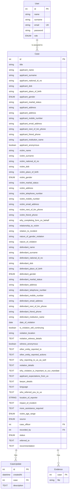

```mermaid
erDiagram
   User {
      int id PK
      string name
      string surname
      string email UK
      string password
      ENUM role
   }

   Case {
      int id PK
      string title
   
      string applicant_name
      string applicant_surname
      string applicant_national_id_no
      string applicant_dob
      string applicant_place_of_birth
      ENUM   applicant_gender
      string applicant_marital_status
      string applicant_address
      string applicant_address
      string applicant_mobile_number
      string applicant_email_address
      string applicant_next_of_kin_phone
      string applicant_friend_phone
      string applicant_institution_name
      boolean applicant_anonymous

      string victim_name
      string victim_surname
      string victim_national_id_no
      string victim_dob
      string victim_place_of_birth
      ENUM   victim_gender
      string victim_marital_status
      string victim_address
      string victim_telephone_number
      string victim_mobile_number
      string victim_email_address
      string victim_next_of_kin_phone
      string victim_friend_phone
      string why_completing_form_on_behalf
      string relationship_to_victim
      string relation_to_incident
      string nature_of_gender_violation
      string nature_of_violation

      string defendant_name
      string defendant_surname
      string defendant_national_id_no
      string defendant_dob
      string defendant_place_of_birth
      ENUM   defendant_gender
      string defendant_marital_status
      string defendant_address
      string defendant_telephone_number
      string defendant_mobile_number
      string defendant_email_address
      string defendant_next_of_kin_phone
      string defendant_friend_phone
      string defendant_institution_name
      
      date date_of_violation
      boolean is_violation_still_continuing
      string violation_location
      TEXT violation_witness_details
      boolean witness_anonymous
      TEXT other_entity_reported_to
      TEXT other_entity_reported_actions
      TEXT why_reporting_to_us_as_well
      TEXT violation_details
      TEXT why_violation_is_important_to_our_mandate
      TEXT applicant_expectations_from_us
      TEXT lawyer_details
      TEXT language
      TEXT who_referred_you_to_us
      STRING location_of_reporter
      TEXT impact_of_incident
      TEXT more_assistance_required
      ENUM victim_age_range

      ENUM source
      int case_officer FK
      int recorded_by FK
      ENUM status
      TEXT referred_to
      TEXT recommendation

   }

   CaseUpdate {
      int id PK
      datetime createdAt
      int case FK
      TEXT description
   }

   Evidence {
      int case FK
      string file
   }

   Case ||--o{ CaseUpdate: "Has"
   Case ||--o{ Evidence: "Has"
   User ||--o{ Case: "Is assigned to"

```

