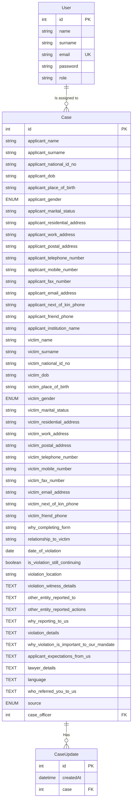

```mermaid
erDiagram
   User {
      int id PK
      string name
      string surname
      string email UK
      string password
      string role
   }

   Case {
      int id PK
   
      string applicant_name
      string applicant_surname
      string applicant_national_id_no
      string applicant_dob
      string applicant_place_of_birth
      ENUM   applicant_gender
      string applicant_marital_status
      string applicant_residential_address
      string applicant_work_address
      string applicant_postal_address
      string applicant_telephone_number
      string applicant_mobile_number
      string applicant_fax_number
      string applicant_email_address
      string applicant_next_of_kin_phone
      string applicant_friend_phone
      string applicant_institution_name

      string victim_name
      string victim_surname
      string victim_national_id_no
      string victim_dob
      string victim_place_of_birth
      ENUM   victim_gender
      string victim_marital_status
      string victim_residential_address
      string victim_work_address
      string victim_postal_address
      string victim_telephone_number
      string victim_mobile_number
      string victim_fax_number
      string victim_email_address
      string victim_next_of_kin_phone
      string victim_friend_phone
      string why_completing_form
      string relationship_to_victim
      
      date date_of_violation
      boolean is_violation_still_continuing
      string violation_location
      TEXT violation_witness_details
      TEXT other_entity_reported_to
      TEXT other_entity_reported_actions
      TEXT why_reporting_to_us
      TEXT violation_details
      TEXT why_violation_is_important_to_our_mandate
      TEXT applicant_expectations_from_us
      TEXT lawyer_details
      TEXT language
      TEXT who_referred_you_to_us


      ENUM source
      int case_officer FK

   }

   CaseUpdate {
      int id PK
      datetime createdAt
      int case FK
   }

   Case ||--o{ CaseUpdate: "Has"
   User ||--o{ Case: "Is assigned to"

```

