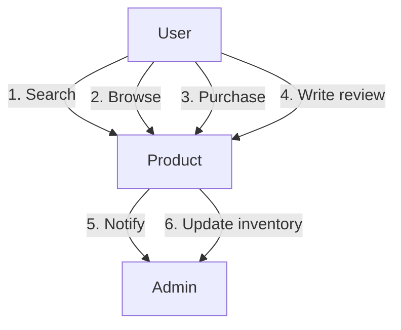

```mermaid
graph TD
   User --> |1. Search| Product
   User --> |2. Browse| Product
   User --> |3. Purchase| Product
   User --> |4. Write review| Product
   Product --> |5. Notify| Admin
   Product --> |6. Update inventory| Admin
```

@startuml
left to right direction
actor User
rectangle {
usecase Login
usecase Logout
usecase Search
}
User --> Login
User --> Search
Logout --> User
@enduml
